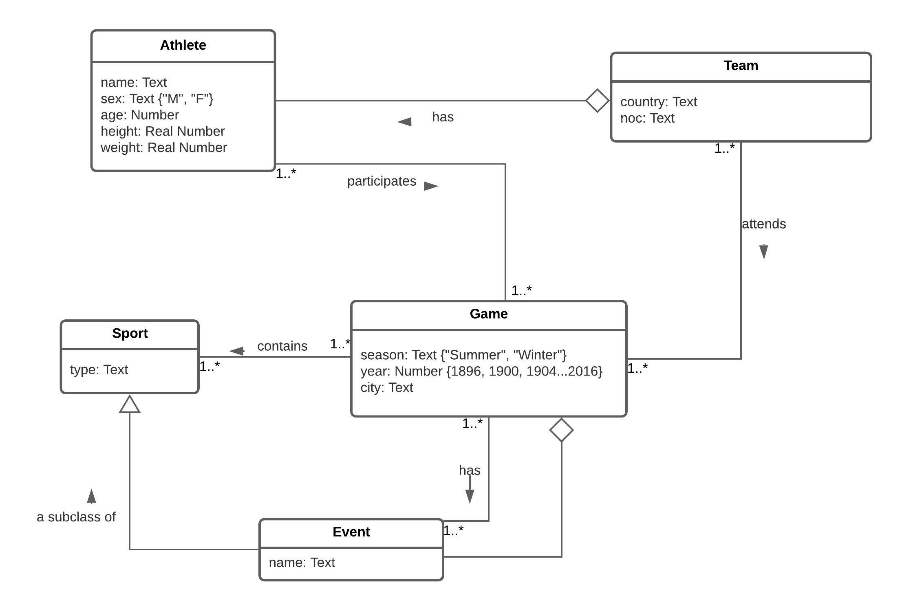
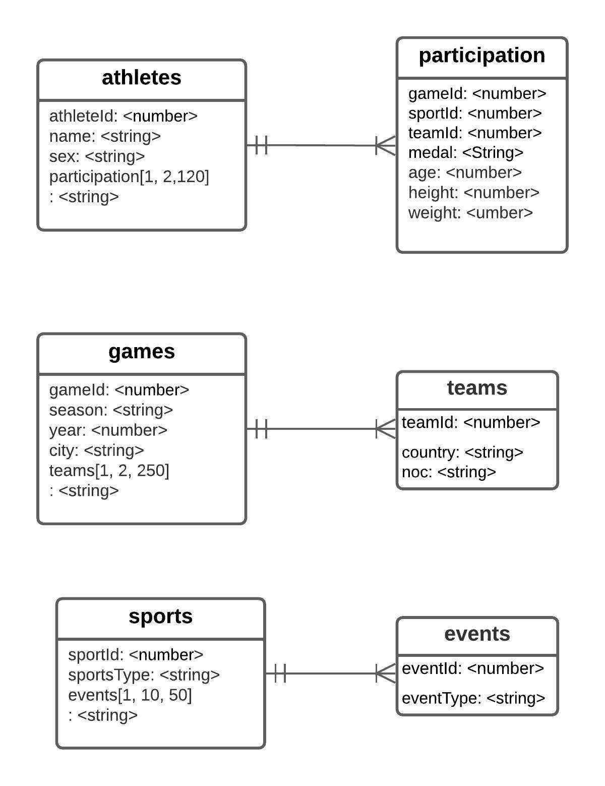

# cs5200project1

## Contributors

- Orkhan Dadashov
    - Automated reading an input excel file and clean it and creating collections and populated the collections.  
    - designing the functions which we will use and also helped me to test and add + update mongoDB qury for our node project
    - All Search bars in all pages with complex several joins : main, event, sport page,their view, and all functions and query and connection to the main page
    - Paginations for the main, event, sport. Also paginations for the serachbar results.
    - Sport Gender statistics page, view, query and all connecting parts
    - testing & verifying all the functionalities
    - Corrected bugs in Athlete edit/delete/create functionalities


- Meilin Liu
    - creation of new athlete, it`s view, and all functions and query and connection to the main page, 
    - testing final product of the project, designing the functions which we will use and also helped me to test and add + update 
    - mongoDB query for our node project Delete the athlete, view and all connection parts 
    - mongoDB query for Update the athlete, view and all connection parts 
    - implementation fo the seachbar and view and all connection parts
hr/>

## How to run ?

### 1. Install all required packages

```
npm install
```

### 2. Initialzie Database and Table

```
npm run initializeDB
```

To run NodeJS app, please run the below commands:

```
cd part3

npm run start
```


Point your browser to http://localhost:3000

Based on our data access queries:

```
Search game by country
Athlete:
    Search by athlete name
    Create a new athlete
    Delete an athlete
    Update an athlete information
    the games athlete participated in edit page
Sports:
    Search by sport type 
    Also includes Gender count per sport type
Events:
    Search by event type
    Search by sport type
```

### Document design
We have come up with this collection design:

```
Games : [{ 
    gameId,
    season,
    year,
    city,
    teams : [{
        teamId,
        country,
        noc
    }]
}]

Athletes : [{
    athleteId,
    name,
    sex,
    participation : [{
        sportId,
        gameId,
        teamId,
        age,
        height,
        weight,
        medal
    }]
}]

Sports : [{
    sportId,
    sportsType,
    events : [{
        eventId,
        eventType
    }]
}]
```


### Python notebbok included :
Description : I have created this file to automate reading the excel file and creating the collections an populating it
- Please see under the folder part3->db->Create-MongoDB-Data.ipynb


### UML
[Project2 UML](https://lucid.app/lucidchart/47f13deb-0c7c-49cc-9430-6288f6ab24e9/edit?invitationId=inv_6602d40b-2285-42b7-b5b8-753d12cb2c87&page=C6OtEU73amNs#)



### ERD 
[Project2 ERD](https://lucid.app/lucidchart/47f13deb-0c7c-49cc-9430-6288f6ab24e9/edit?invitationId=inv_6602d40b-2285-42b7-b5b8-753d12cb2c87&page=-dPtwG2e__IQ#)



### Five Queries- Please see under the folder part3->Define_and_execute_at_least_five_queries_cs5200_Project2.pdf

