# cs5200project1

## Contributors

- Orkhan Dadashov
    - Sports Page populating Redis db
    - show all sports in Redis DB
    - Read sport, Update sport, create sport, delete sport function
    - Pagination of the Sports page, pagination of sport`s edit page events list
   

### Document design

## How to run ?

### 1. Install all required packages

```
npm install
```

### 2. Initialzie MongoDB Database and Table

```
npm run initializeDB

```

### 3. Start redis server
```
redis-server
```

### 3. Initialzie Redis

will populate redis db

```
npm run initializeRedis

```


To run NodeJS app, please run the below commands:

```
cd part4

npm run start
```


Point your browser to http://localhost:3000


Our MongoDB data structure is designed like below:

```
Games : [{ 
    gameId,
    season,
    year,
    city,
    teams : [{
        teamId,
        country,
        noc
    }]
}]

Athletes : [{
    athleteId,
    name,
    sex,
    participation : [{
        sportId,
        gameId,
        teamId,
        age,
        height,
        weight,
        medal
    }]
}]

Sports : [{
    sportId,
    sportsType,
    events : [{
        eventId,
        eventType
    }]
}]
```


### Python notebbok included :
Description : I have created this file to automate reading the excel file and creating the collections an populating it
- Python notebook


### Tasks :

Part 1:
## UML
[Project2 UML](https://lucid.app/lucidchart/47f13deb-0c7c-49cc-9430-6288f6ab24e9/edit?invitationId=inv_6602d40b-2285-42b7-b5b8-753d12cb2c87&page=C6OtEU73amNs#)

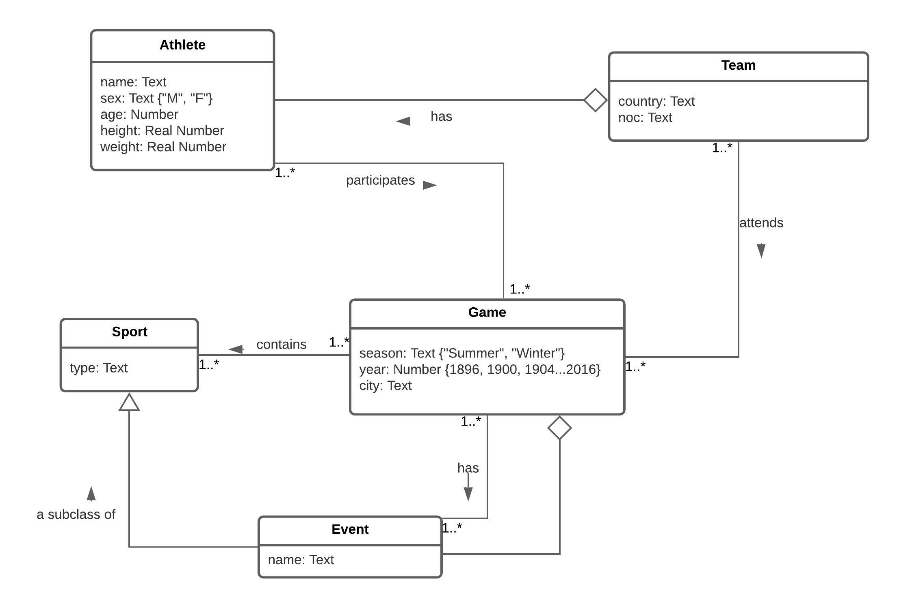

I have used from previous project getSports() function for getiing sport and used it`s results in populationg my redis db.
- For Using redis as db i have created below function:
    - getSportsCountRedis() -> which will return the number of sports in my DB
    - getSports() -> gets all sports from mongoDB and return back an array
    - getEventsBySportRedis() -> which take as an input sportType and return all events related to the sport
    - getSport() -> takes sportID and return sport from redis db
    - updateSport() -> takes input sportID and ref (text) and updates the chosen sport
    - getEventsBySportId() -> gets events by sportID
    - deleteSport() -> takes sportID and deletes it form db
    - insertSport() -> Takes an input text (exp :sport name) and inserts it to the redis db


Part 2:
- In populateRedis i have used below data structures:
    - Set -> await client.set(hKey, sports[i].sportsType + "," +sports[i].sportId); Here i am saving as a key my sportId and as a value i am saving my sportType + ID after when i get sport by sportID i split it in sportType and sportID and use it in my function for Redis database
    - List -> await client.rPush("sports", hKey); I am pushing my key (sportType) to the list
    - List await client.rPush(key, events[j].eventType); I am using list to save events in the related sportType
     


### Project outcome Photos :
## Main SportPage :
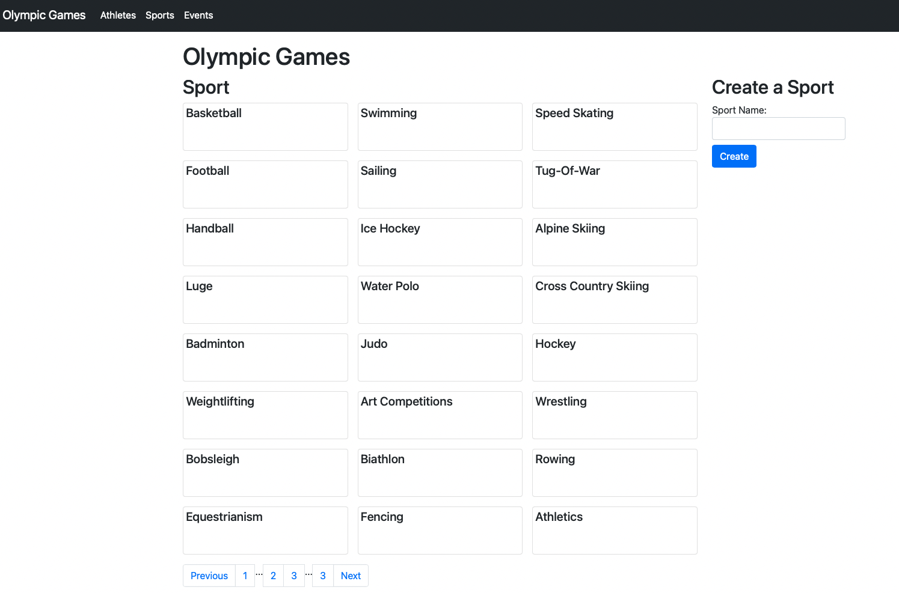

## events by sport :
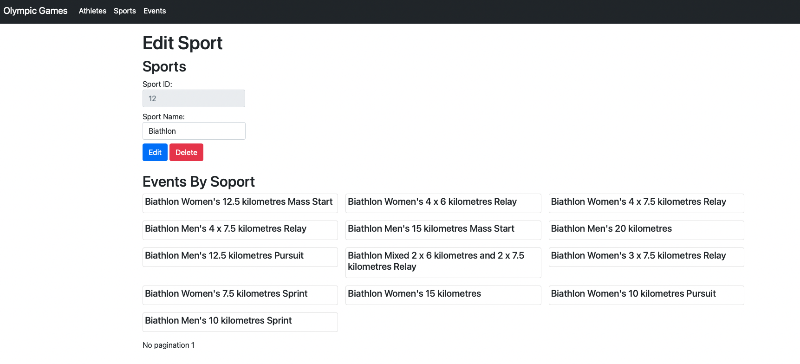


## Sport to update :
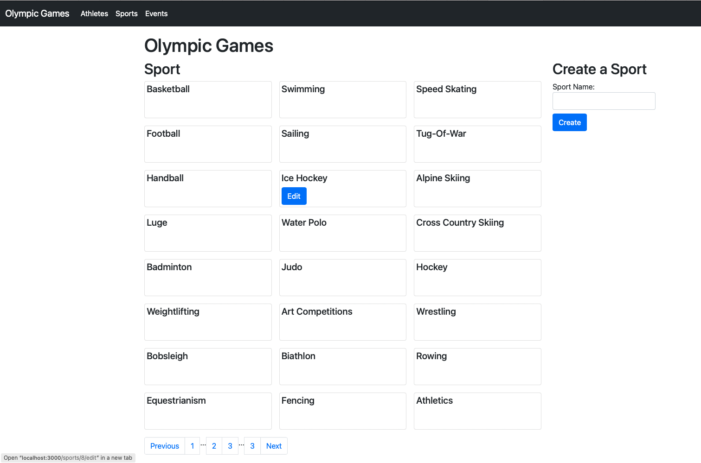

## Edit page of Sport to update :
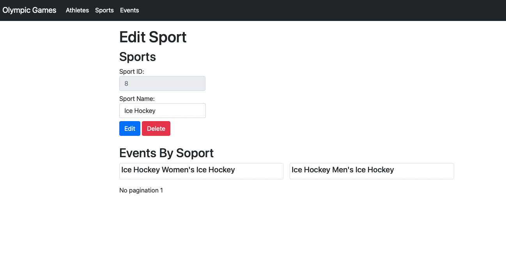

## Current sport (sportType :Ice Hockey, ID : 8 ) editing to  sportType : Test:
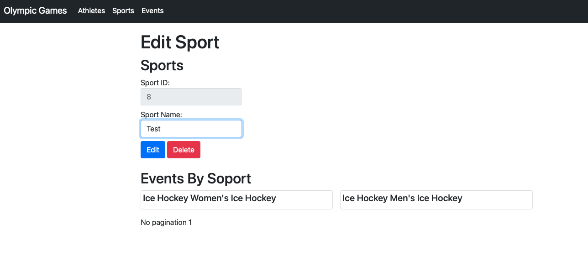

## After updated sportType sportsPage :
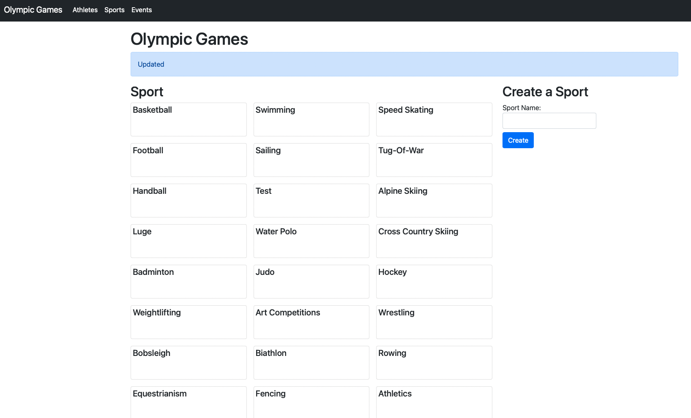

## Checking edited sport's edit page to make sure it has original sport`s events :
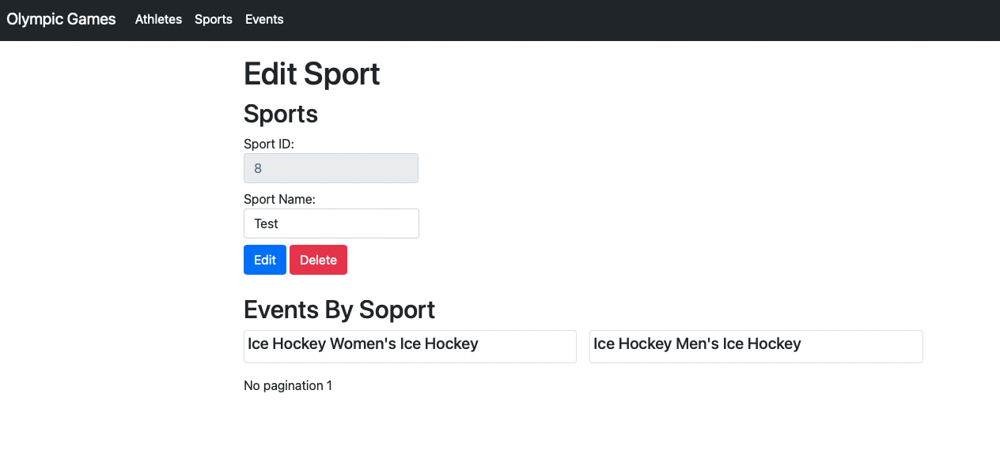

## Creating/Inserting new SportType :
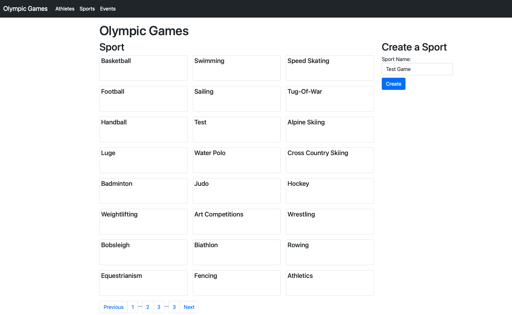
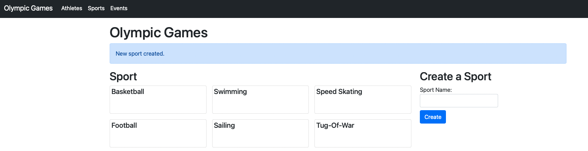
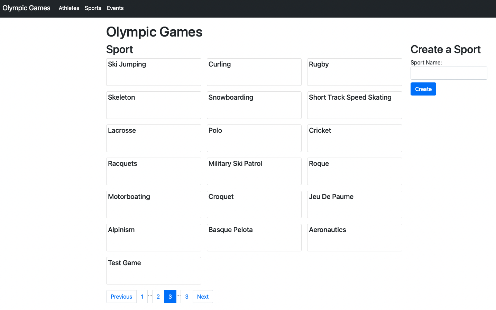

## Deleting new created Sport from edit page :
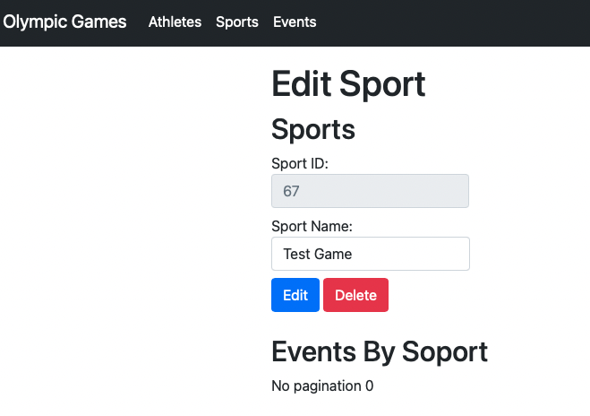
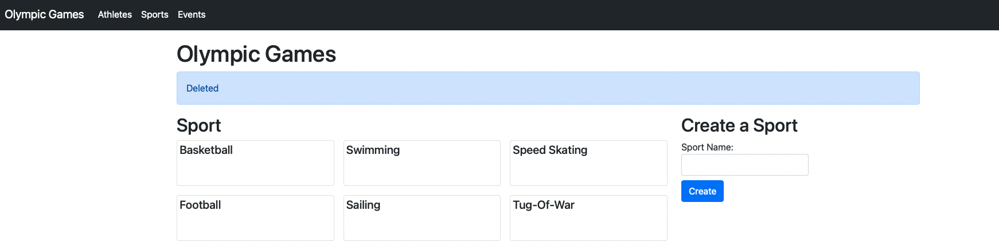
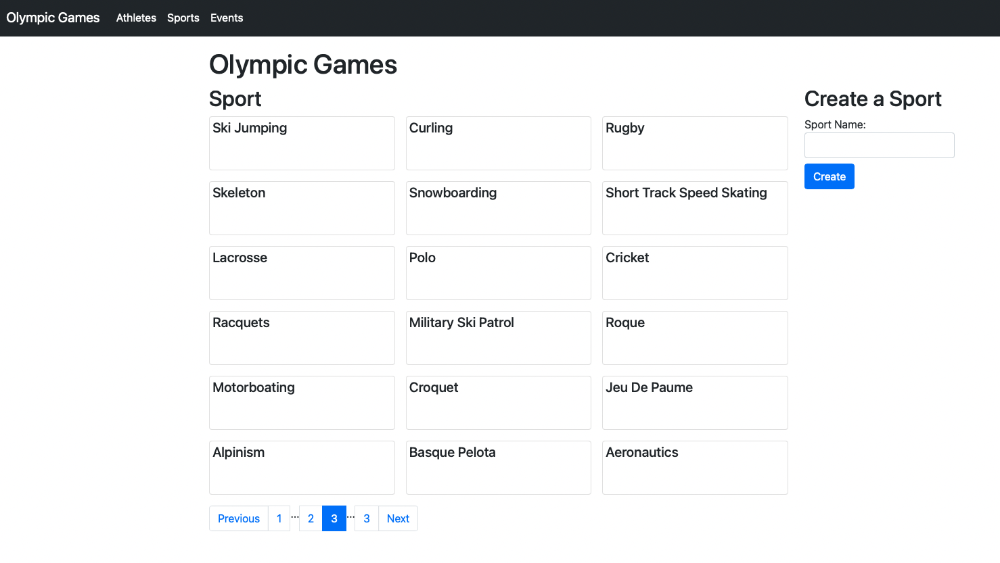


# References:

[cs5200project1/part3](https://github.com/orkhand/cs5200project1/tree/master/part3)

